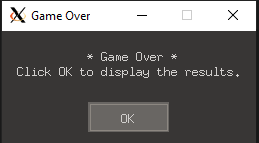

# CPPND: Capstone Snake Game Example

# Overview

Snake Game - is the final Capstone project of my [Udacity C++ Nanodegree Program](https://www.udacity.com/course/c-plus-plus-nanodegree--nd213). The game is developed with new added feature which demonstrate the understanding of C++ features and lessons learned in the program.

# Added Features

* Code enhancements followed by the project rubric mentioned below like using smart pointers, Rule of five, override virtual function, control structures and OOP techniques.
* Added ability to pause the game when clicking escape key.
* Added ability to restart the game without the need of terminating the application.

## Dependencies for Running Locally
* cmake >= 3.7
  * All OSes: [click here for installation instructions](https://cmake.org/install/)
* make >= 4.1 (Linux, Mac), 3.81 (Windows)
  * Linux: make is installed by default on most Linux distros
  * Mac: [install Xcode command line tools to get make](https://developer.apple.com/xcode/features/)
  * Windows: [Click here for installation instructions](http://gnuwin32.sourceforge.net/packages/make.htm)
* SDL2 >= 2.0
  * All installation instructions can be found [here](https://wiki.libsdl.org/Installation)
  * Note that for Linux, an `apt` or `apt-get` installation is preferred to building from source.
* gcc/g++ >= 5.4
  * Linux: gcc / g++ is installed by default on most Linux distros
  * Mac: same deal as make - [install Xcode command line tools](https://developer.apple.com/xcode/features/)
  * Windows: recommend using [MinGW](http://www.mingw.org/)

## Basic Build Instructions

1. Clone this repo.
2. Make a build directory in the top level directory: `mkdir build && cd build`
3. Compile: `cmake .. && make`
4. Run it: `./SnakeGame`.

## Project Rubric Matches:

### `Loops, Functions, I/O`
1. > The project demonstrates an understanding of C++ functions and control structures.
    - Added while loop condition and if condition to prompt if user want to restart the game or not. `main.h` line `13` and `helper.h` line `8`

2. > The project accepts user input and processes the input.
    - Prompt method which checks if the user entered the selected key or not and return true/false. `helper.cpp` line  `7`.

### `Object Oriented Programming`

1. > The project uses Object Oriented Programming techniques.
    - Header and Src files are divided to `src` and `include` folders.
    - Added setter/getter function for `snake.h` line `31` to `43` and placed object variables to private access specifiers.

2. > Class constructors utilize member initialization lists.
    - `snake.cpp` constructor utilize member initialization lists.

3. > Classes encapsulate behavior.
    - Added namespace for gui constant settings values in `helper.h`.
    - Created new class `helper.cpp` which hold static method to be called in `main.h`

4. > Derived class functions override virtual base class functions..
    - method `HandleInput` in `controller.h` overrides virtual base function.

### `Memory Management`

1. > The project follows the Rule of 5.
    - `snake.h` and `rendere.h` class follows the Rule of 5.

2. > The project uses smart pointers instead of raw pointers.
    - Used shared pointer for `Snake` class objects and unique pointer for `Game` in `Main.cpp`.
